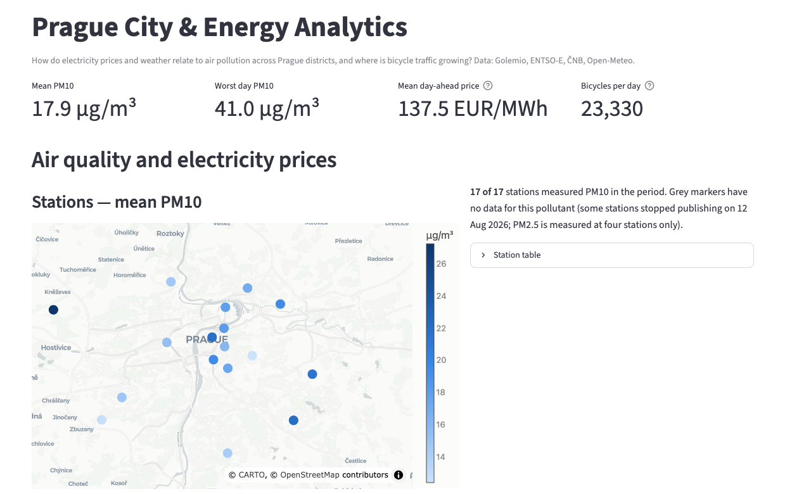
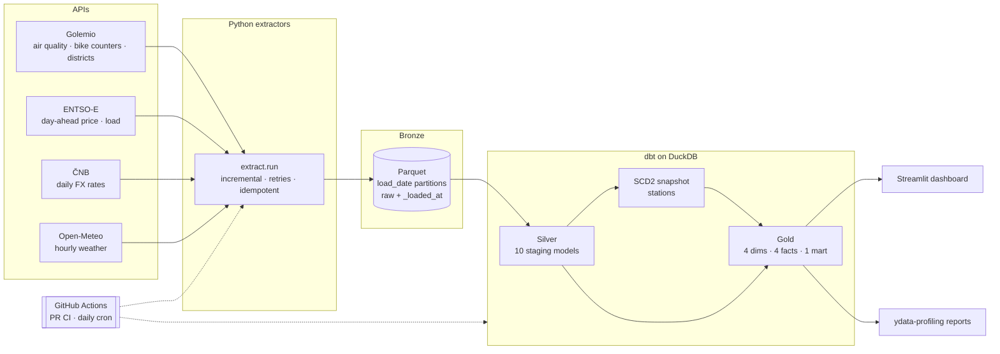
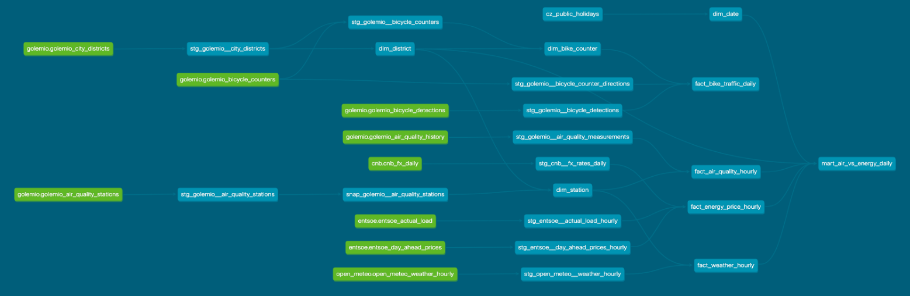
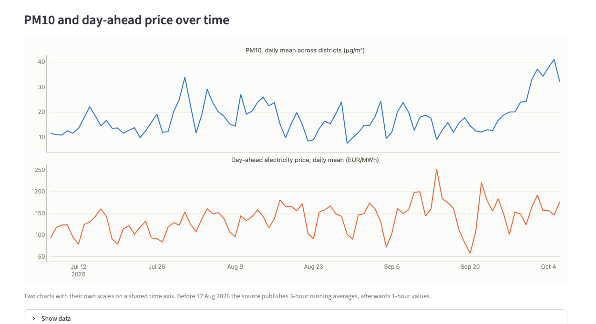
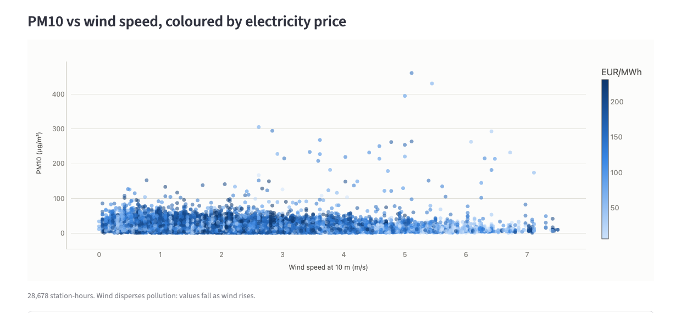
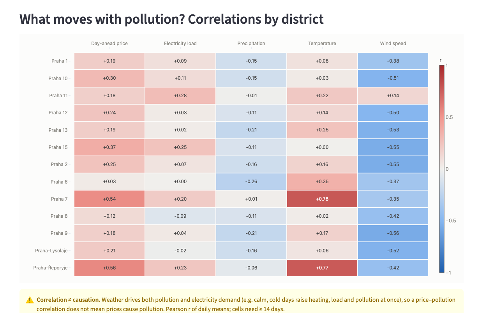
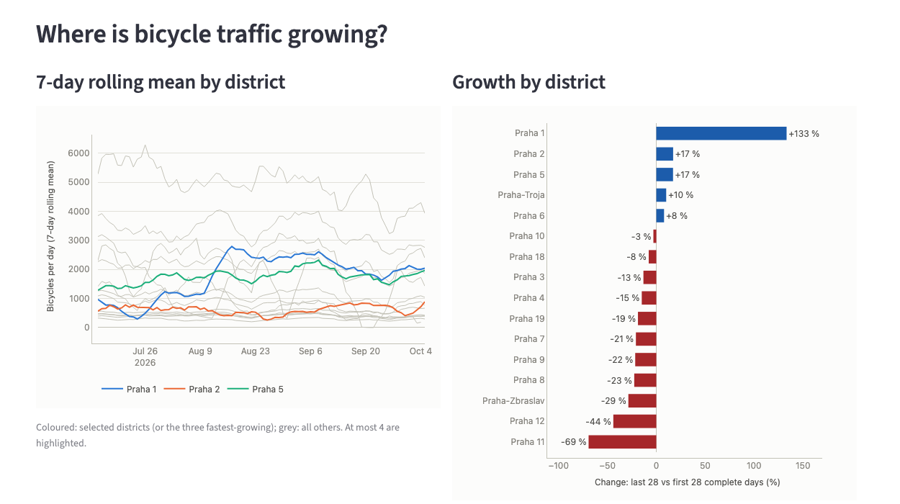

# Prague City & Energy Analytics

[](https://github.com/beibarysasqar/prague-city-energy-analytics/actions/workflows/dbt_ci.yml)

A production-style ELT pipeline on Prague open data: Python extractors land raw API data in a Parquet
bronze layer, dbt builds a tested silver layer, an SCD2 snapshot and a gold star schema in DuckDB, and a
Streamlit dashboard answers two questions:

1. **How are electricity prices and weather related to air pollution across Prague districts?**
2. **Where is bicycle traffic growing?**

Stack: Python 3.12 · uv · requests/tenacity · DuckDB · dbt-core + dbt-duckdb (Snowflake `prod` profile) ·
Streamlit + Plotly · ydata-profiling · GitHub Actions · ruff · sqlfluff · pytest.



## Architecture



| Layer | Where | What |
|---|---|---|
| Bronze | `data/bronze/<source>_<entity>/load_date=YYYY-MM-DD/part.parquet` | Raw records as returned by the API (nested objects as JSON strings) + `_loaded_at`; one partition per day, re-runs overwrite |
| Silver | `dbt/models/staging/` (schema `silver`) | Typing, UTC timestamps, de-duplication, 15 min → hourly, FX forward-fill, point-in-polygon districts |
| Snapshot | `dbt/snapshots/` | SCD2 history of the air-quality station dimension (check strategy) |
| Gold | `dbt/models/marts/` (schema `gold`) | Star schema with incremental facts (`delete+insert`, 3-day lookback) and a district × day mart |

## Data model

| Model | Grain |
|---|---|
| `fact_air_quality_hourly` | station × UTC hour × pollutant (SCD2 station lookup) |
| `fact_weather_hourly` | station × UTC hour |
| `fact_energy_price_hourly` | UTC hour — price EUR/MWh and CZK/MWh (ČNB rate), actual load |
| `fact_bike_traffic_daily` | counter × direction × Prague calendar day, with DST-aware completeness |
| `dim_station` (SCD2), `dim_district`, `dim_bike_counter`, `dim_date` (Czech holidays) | dimensions |
| `mart_air_vs_energy_daily` | district × Prague calendar day — pollution, weather, price, load |

19 models, 9 sources, 1 snapshot, 1 seed, **189 dbt tests** (keys, relationships, accepted values, ranges and the
custom generic tests `non_negative` and `no_time_gaps`).



## Dashboard

Filters (period, districts, pollutant) scope the whole page; every chart has a table view.

| | |
|---|---|
|  |  |
| PM10 and the day-ahead price as **two charts on a shared time axis** (never a dual axis). | Hourly PM10 vs wind speed, coloured by the electricity price. |
|  |  |
| Pearson r per district and driver, with a "correlation ≠ causation" note. | 7-day rolling bike traffic and growth per district (plus a per-counter table). |

## Findings (91 days, 7 Jul – 6 Oct 2026)

- **Wind is the clearest driver of PM10**: r ≈ −0.35 to −0.56 in 12 of 13 districts — windy days disperse
  particulate matter.
- **Day-ahead price and PM10 are only weakly correlated** (r ≈ 0.0–0.37) in districts with year-round data.
  Praha 7 and Řeporyje show r ≈ 0.55 but only have summer data (their stations stopped publishing on 12 Aug).
  Weather drives both demand and pollution, so this is not evidence that prices cause pollution.
- **Bike traffic**: Praha 1 (+133 %), Praha 2 and Praha 5 (+17 %) grow most when comparing the last and first 28
  complete days; most districts decline into autumn. The Praha 1 jump comes almost entirely from one counter
  (Smetanovo nábřeží, ×13 since mid-August — likely a sensor or road change), which is why the dashboard shows
  growth per counter as well.

## Design decisions

- **Raw bronze, typed silver.** Bronze stores records as returned (nested objects as JSON strings, so the Parquet
  schema never drifts); all typing happens in dbt.
- **Idempotent, incremental extraction.** One partition per day, written atomically; re-runs overwrite. A state file
  drives incremental windows; sources that revise recent data (bike counters, weather) re-load the last 3 days.
- **Partition by the business day.** ENTSO-E data is partitioned by the Prague *delivery day* (23/25 h on DST days),
  timestamps are stored in UTC, and the half-open `[start, end)` window avoids double-counting boundary points.
- **Secrets never leak.** ENTSO-E puts the API key in the query string, so request errors would contain it; all calls
  go through a wrapper that retries and re-raises sanitised errors without the original exception chain (tested).
- **Measured hour ≠ publication time.** Golemio publishes air quality 10–50 min after the hour; silver derives the
  measured hour and keeps the latest re-publication.
- **SCD2 that works for history.** The station snapshot started after the data; the first version of each station is
  therefore valid from 1900-01-01, and facts look up the version valid at their hour.
- **Reference data never disappears.** Stations, counters and districts are built from all snapshots; a record the
  source removes stays with `is_listed = false`, and the SCD2 snapshot records the removal as a new version; records
  seen in the facts but in no loaded snapshot become inferred members. (Learned in production: the first scheduled
  run failed when Golemio removed station ALEGA from its list.)
- **Incremental = full refresh, bit for bit.** DuckDB's parallel float aggregation is not reproducible, so averages
  feeding incremental models are computed in DECIMAL (`stable_avg`); verified by comparing content hashes.
- **Contract vs drift tests.** Tests on our model (keys, relationships, our computations) fail the build; tests on
  what the source sends (new categories, out-of-range values, time gaps) warn — a changing world must not stop the
  daily load, a broken model must. `non_negative` is never applied to prices (they can be negative).
- **Freshness informs, does not block.** `dbt source freshness` is reported, but one stale API does not stop the
  refresh of all other sources.
- **Portable SQL.** Cross-database macros (`dbt.date_trunc`, `dbt_utils`, `adapter.dispatch` for spatial and time-zone
  functions) keep the Snowflake `prod` target close.
- **Dependency isolation.** ydata-profiling needs pandas < 3, so the profiler is a PEP 723 script with its own env.
- **Charts that do not mislead.** No dual axes, colour follows the entity, a CVD-validated palette and a grey
  midpoint for signed values.

## Data quality issues found in the sources

| Source | Issue | Handling |
|---|---|---|
| Golemio air quality | Averaging switched from 3-hour running means to 1-hour values on 2026-08-12 | Kept as `averaging_hours`; nothing filtered on it |
| Golemio air quality | Re-publications of the same hour (HH:40) | Latest publication wins |
| Golemio bike counters | Direction ids shared by two counters; a `null` direction in the catalogue | Natural key incl. counter id; direction names inferred and flagged |
| ENTSO-E | Day-ahead prices sent as two identical series | De-duplicated before hourly aggregation |
| ČNB | Future dates silently return the latest rates | Extraction window clamped to today |
| Golemio air quality | Stations removed from the list (ALEGA on 2026-10-06) while their history remains | Kept with `is_listed = false`; SCD2 records the removal |
| Open-Meteo | Future end dates rejected (HTTP 400) | Window clamped to today (UTC) |
| ČNB ARAD | No daily official EUR/CZK fixing | Public ČNB FX API used instead |

## How to run

Prerequisites: [uv](https://docs.astral.sh/uv/) (it installs Python 3.12), a
[Golemio API key](https://api.golemio.cz/api-keys) and an
[ENTSO-E API key](https://transparency.entsoe.eu/) (ČNB and Open-Meteo need none).

```bash
git clone https://github.com/beibarysasqar/prague-city-energy-analytics.git
cd prague-city-energy-analytics
cp .env.example .env          # fill GOLEMIO_API_KEY and ENTSOE_API_KEY
uv sync

make extract                  # first run: last 90 days into data/bronze (incremental afterwards)
make dbt                      # dbt deps → source freshness → build (models, snapshot, tests)
make app                      # Streamlit dashboard on http://localhost:8501
make profile                  # ydata-profiling reports → profiling/reports/
make docs                     # dbt docs with the lineage graph
make lint && make test        # ruff, sqlfluff, actionlint · pytest
```

`uv run python -m extract.run --source <name> --start YYYY-MM-DD --end YYYY-MM-DD` (or `--days N`) loads a
specific window. For CI, add `GOLEMIO_API_KEY` and `ENTSOE_API_KEY` as repository secrets.

## CI and orchestration

- **`dbt_ci.yml`** (every pull request): `uv sync --locked` → extract the last 7 days → `dbt build` → lint → pytest.
- **`daily.yml`** (13:30 UTC): restores `data/` from the Actions cache, runs an incremental extract, `dbt build` and
  profiling, then saves the cache and uploads the reports and the warehouse as artifacts. A `keepalive` job makes an
  empty commit after 45 idle days, so GitHub never disables the schedule (it does after 60 days without activity).
- **Airflow**: [`orchestration/`](orchestration/) contains an example Airflow 3 DAG of the same pipeline
  (documented, validated by parsing, not deployed).

## Project structure

```
extract/            Python extractors (one module per source) + CLI extract.run
dbt/                dbt project "prague": staging (silver), marts (gold), snapshots, seeds, macros, tests
app/                Streamlit dashboard (layout, data access, charts, theme)
profiling/          ydata-profiling script (reports are generated, not committed)
orchestration/      example Airflow DAG
tests/              pytest: extractors (mocked HTTP), app, profiling, CLI
.github/workflows/  PR CI and daily pipeline
docs/images/        README screenshots
```

## Testing and quality

- **pytest**: 117 tests — extractors against recorded API fixtures with mocked HTTP (retries, pagination,
  idempotency, secret handling), dashboard transforms and chart rules, an end-to-end Streamlit smoke test.
- **dbt**: 189 tests in every `dbt build`; incremental results verified against full refreshes.
- **Lint**: ruff, sqlfluff (dbt templater), actionlint — all run in CI.

## Roadmap

- Year-over-year bike growth once a full year of data is available.
- Deploy the `prod` target to Snowflake (JSON parsing would move to `FLATTEN`).
- Host dbt docs (lineage) on GitHub Pages.
- Switch profiling to `fg-data-profiling`, the maintained successor of ydata-profiling.
- More Golemio datasets (e.g. building energy) and ČNB ARAD series (interest rates).

## License

[MIT](LICENSE)
